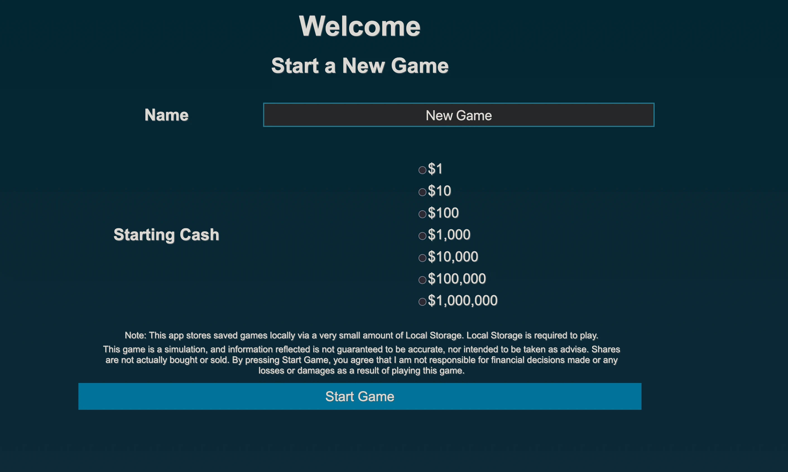

# Stock Trading Simulator

### Features
+ Simulated buy and sell orders (at current market price according to Yahoo Finance).
+ Search Yahoo Finance for financial information.
+ Uses LocalStorage to store game data. Does not need a server to save any data!

### Folder Overview
+ **Dev** - Miscellaneous Info and Testing
+ **Docs** - The Requirements (SRS) and a Design Document (SDD)
+ **Public** - The Client-Side HTML, SCSS (and compiled CSS) and JavaScript
+ **Server** - The Server-Side Application

### SRS and SDD
Both the Software Requirement Specification and the Software Design Document are available in the docs folder. I am certainly new to writing them.

### Attribution
The library uses Yahoo Finance for requesting prices and other information. 

### Notice
The project is a game, and not intended to be used as financial advise. By using this project, you do so at your own risk. 